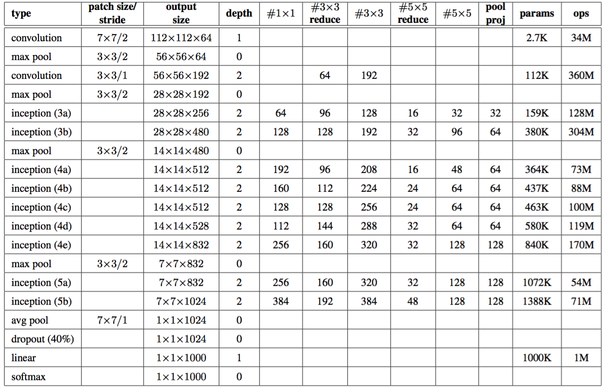

# googLeNet
here is my implementation of the basic googLeNet described in the paper [Going Deeper with Convolutions](http://www.cv-foundation.org/openaccess/content_cvpr_2015/html/Szegedy_Going_Deeper_With_2015_CVPR_paper.html) in keras

I wrapped the inception module described in the paper and put it in the file "inceptionModel.py"

the structure of the net is described as following:

